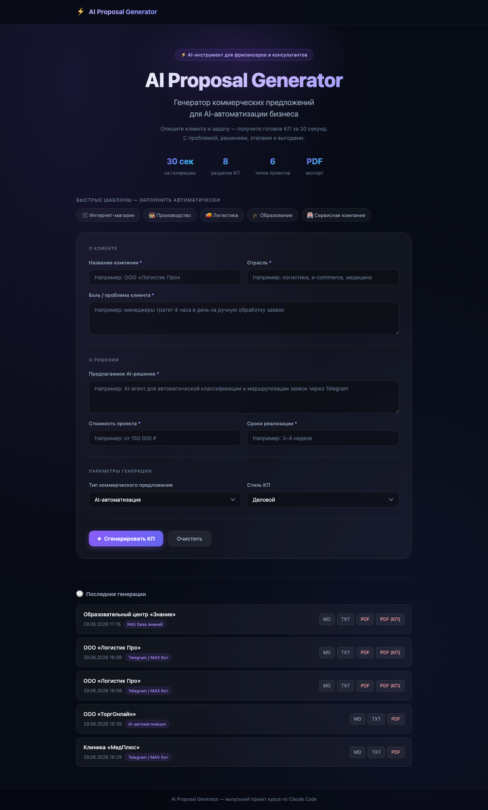
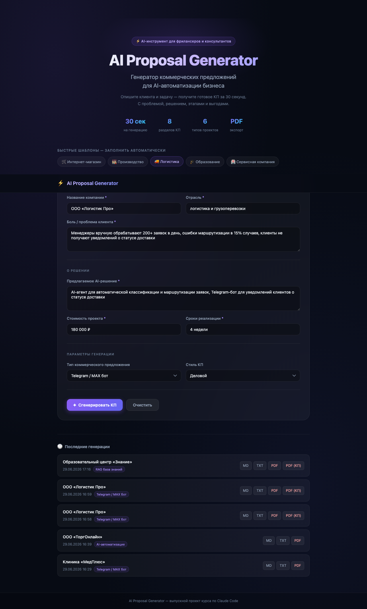
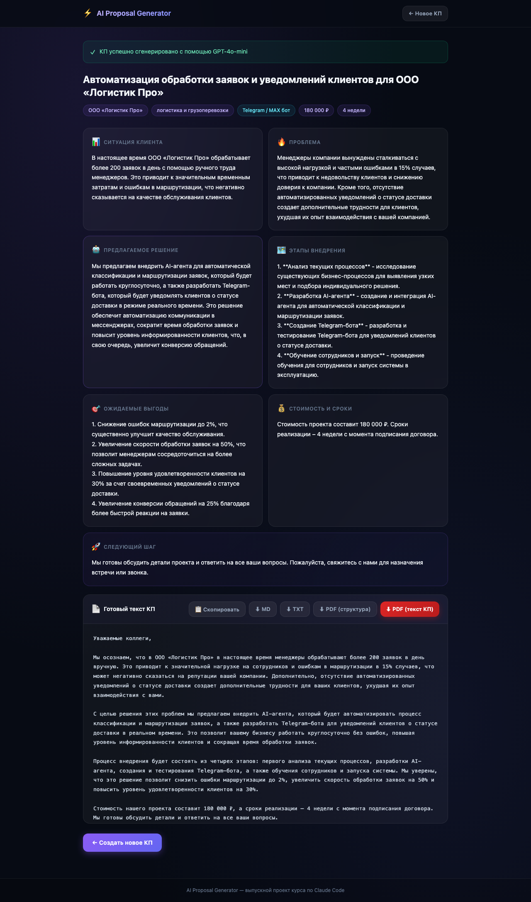
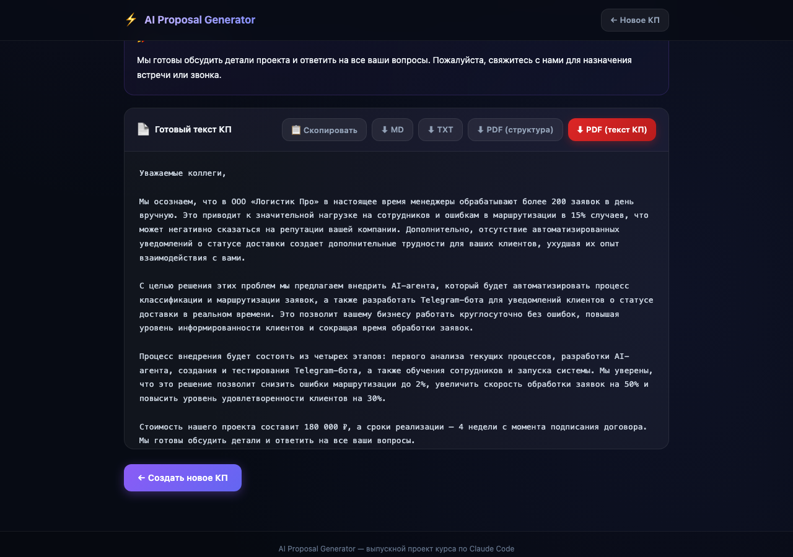
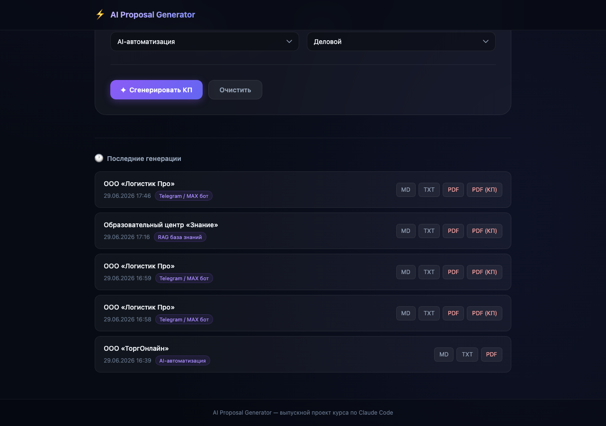

# ⚡ AI Proposal Generator

Веб-сервис для быстрой генерации коммерческих предложений по AI-автоматизации бизнеса.

---

## Какую проблему решает

Фрилансеры и AI-специалисты тратят 1-3 часа на подготовку каждого коммерческого предложения.
Этот инструмент сокращает время до 30 секунд: пользователь вводит данные о клиенте и задаче —
сервис генерирует структурированный черновик КП, готовый к отправке или доработке.

---

## Для кого полезен

- AI-фрилансеры и консультанты по автоматизации
- Менеджеры по продажам IT-услуг
- Студенты и выпускники курсов по AI, которые собирают первое портфолио

---

## Возможности MVP

- Заполнение формы с описанием клиента, проблемы и решения
- Выбор стиля КП: деловой, простой, экспертный, уверенный
- Генерация через OpenAI GPT-4o-mini (или демо-режим без ключа)
- Структурированный результат: 8 готовых разделов
- Полный текст КП для отправки клиенту
- Копирование в буфер одним кликом
- Скачивание в формате `.md` или `.txt`

---

## Стек технологий

| Компонент        | Технология               |
|-----------------|--------------------------|
| Backend         | Python + Flask           |
| AI-генерация    | OpenAI API (GPT-4o-mini) |
| Frontend        | HTML + CSS (без фреймворков) |
| Конфигурация    | python-dotenv            |
| Хранение файлов | Локальная папка outputs/ |

---

## Локальный запуск

### 1. Клонировать репозиторий

```bash
git clone https://github.com/your-username/ai-proposal-generator.git
cd ai-proposal-generator
```

### 2. Создать виртуальное окружение

```bash
python3 -m venv venv
source venv/bin/activate  # macOS / Linux
# venv\Scripts\activate   # Windows
```

### 3. Установить зависимости

```bash
pip install -r requirements.txt
```

### 4. Настроить переменные окружения

```bash
cp .env.example .env
```

Откройте `.env` и вставьте ваш OpenAI API-ключ:

```
OPENAI_API_KEY=sk-...ваш ключ...
```

> Без ключа сервис работает в **демо-режиме** — генерирует КП по шаблону.

### 5. Запустить приложение

```bash
python app.py
```

Откройте в браузере: [http://localhost:5000](http://localhost:5000)

---

## Пример пользовательского сценария

**Ситуация:** фрилансер хочет отправить КП клиенту — логистической компании.

1. Заполняет форму:
   - Клиент: ООО «Логистик Про»
   - Отрасль: логистика и доставка
   - Проблема: менеджеры вручную обрабатывают 200+ заявок в день, ошибки в 15% случаев
   - Решение: AI-агент для автоматической классификации и маршрутизации заявок
   - Стоимость: 180 000 ₽
   - Сроки: 4 недели
   - Стиль: Экспертный

2. Нажимает «Сгенерировать КП»

3. Получает готовый документ с 8 разделами за ~10 секунд

4. Копирует текст или скачивает `.md`-файл

5. Вставляет в шаблон презентации и отправляет клиенту

---

## Структура проекта

```
ai-proposal-generator/
├── app.py                  # Flask-приложение, логика генерации
├── requirements.txt        # Python-зависимости
├── .env.example            # Шаблон переменных окружения
├── .gitignore              # Исключения для Git
├── README.md               # Документация
├── templates/
│   ├── index.html          # Главная страница с формой
│   └── result.html         # Страница результата
├── static/
│   └── style.css           # Стили (тёмная тема)
└── outputs/
    └── .gitkeep            # Папка для сохранённых КП
```

---

## Скриншоты

### Главная страница с быстрыми шаблонами и историей генераций


### Форма с автозаполнением по шаблону «Логистика»


### Страница результата — 8 разделов КП + экспорт


### Кнопки скачивания: MD, TXT, PDF (структура), PDF (текст КП)


### Последние генерации с быстрым доступом к файлам


---

## Деплой через Docker

### Быстрый запуск

```bash
docker build -t ai-proposal-generator .
docker run -d \
  -p 5000:5000 \
  -e OPENAI_API_KEY=sk-...your-key... \
  -v $(pwd)/outputs:/app/outputs \
  --name proposal-app \
  ai-proposal-generator
```

Откройте в браузере: `http://localhost:5000`

### Docker Compose

Создайте `docker-compose.yml`:

```yaml
services:
  app:
    build: .
    ports:
      - "5000:5000"
    environment:
      - OPENAI_API_KEY=${OPENAI_API_KEY}
    volumes:
      - ./outputs:/app/outputs
    restart: unless-stopped
```

Запуск:

```bash
# Переменная берётся из .env автоматически
docker compose up -d
```

### Деплой на VPS (Dokploy / любой Docker-хостинг)

1. Залейте репозиторий на GitHub
2. В Dokploy создайте новый проект → Source: GitHub repo
3. В переменных окружения добавьте `OPENAI_API_KEY`
4. Добавьте volume: `/app/outputs` → для сохранения экспортируемых файлов
5. Настройте домен и SSL через Dokploy — Traefik подключится автоматически

### Полезные команды

```bash
docker logs proposal-app          # просмотр логов
docker exec -it proposal-app sh   # войти в контейнер
docker compose down               # остановить
docker compose up -d --build      # пересобрать и запустить
```

---

## Что можно улучшить в будущем

- [ ] Поддержка Anthropic Claude (claude-sonnet-4-6) как альтернативы GPT
- [ ] Кастомизация логотипа и реквизитов компании в PDF
- [ ] Телеграм-бот для генерации КП прямо в мессенджере
- [ ] Деплой на VPS через Docker + Dokploy
- [ ] Экспорт в DOCX через python-docx

---

## Лицензия

MIT — используйте свободно для личных и коммерческих проектов.

---

*Выпускной проект курса по Claude Code. Сгенерировано с помощью Claude Code + GPT-4o-mini.*
